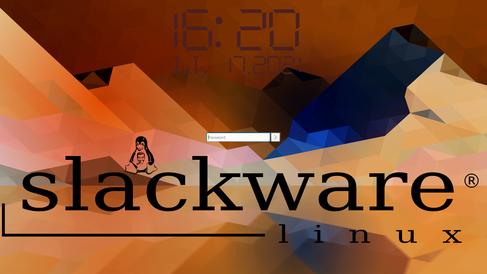

# Chili login theme for KDE Plasma

Slacker is hot, just like a real chili! Spice up the login experience for your users, your family and yourself. Slacker reduces all the clutter and leaves you with a clean, easy to use, login interface with a modern yet classy touch.

Slacker for [KDE Plasma](https://www.kde.org/plasma-desktop) is the desktop environment *specific* version with *enhanced functionality* . If you don't use Plasma as your desktop environment you would likely prefer [Slacker for SDDM](https://github.com/Drakeo/Slacker.git).

### Prerequisites

KDE Plasma 5  
SDDM
